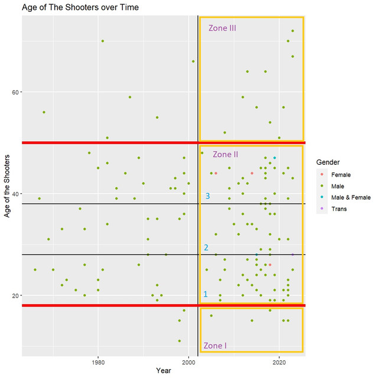

```{r setup, include=FALSE}
knitr::opts_chunk$set(echo = TRUE)
```

## Why is this subject?

  - A controversial topic (Gun Violence)

  - Provide an edge of the problems, a tip of the iceberg.
  
  - Raise your insights about the problems, then you can draw conclusions for yourself in order to protect you and your family.
  
  - Recognize the primitive signs, not to live in skeptics but to enhance your awareness.


##

<br>
<br>
<br>
<br>

>_"If you look at the number of Americans killed since 9/11 by terrorism, it's less than 100. If you look at the number been killed by gun violence, it's in the tens of thousands."_

<br>
```{r echo=FALSE, out.width='50%', fig.align='center'}


```

<center>


"The 44th US President - Barack Obama"


</center>

<br>

[Source: NBCNews](https://www.nbcnews.com/politics/white-house/obama-gun-control-im-frustrated-lack-common-sense-laws-n397646)


## DATA
  
  ``` Words on my data set ```


- **164 observations and 26 variables** from 1960 to 2023.
  (It was 143 observations and 25 variables originally from 1982 to 2022)

- My data set's limitation:

  + Two data sets with two completely different structures.
  + Various manually plug-in data (15%)

  # **Mother Jones**
  <https://www.motherjones.com/politics/2012/12/mass-shootings-mother-jones-full-data/>

- The data set's authors are MARK FOLLMAN, GAVIN ARONSEN, and DEANNA PAN.

- The time span they collect is from 1982 to present, which included `originally 143 observations and 25 variables`. This is my work's mainframe.

  # **The Violence Project**
  <https://www.theviolenceproject.org/>

- No specific author's names.

- The time span is from 1960 to 2022. This is the supplemental data for my main data frame.

  


## DATA(cont.)

```{r Input Source, echo=TRUE, message=FALSE, warning=FALSE}
my_data <- read.csv('Mother Jones - Mass Shootings Database, 1982 - 2023 - Sheet1.csv', na.strings = "-")
my_data2 <- read.csv('Violence Project Mass Shooter Database - Version 6.1 - Full Database.csv', na.strings = "-")
```

- both in form of `csv file`.

  > First set: familiar with what we have been learned so far.

  > Second set: highly complicated

- Missing data:

  > NA (Not Available) - Missing value
  
  > Unclear - The information has not been revealed by the authority.
  
  > TBD (To Be Determined) - The information has not been confirm yet.


## A Glimpse Over the Data


```{r Packages Glimpse, message=FALSE, warning=FALSE, include=FALSE, results='markup'}
#install.packages(tidyverse)
library(dplyr)
library(tidyverse)
library(stringr)
```


```{r Glimpse, echo=TRUE, message=FALSE, warning=FALSE, results='markup'}
glimpse(my_data)

```

## Data Key Terms

**Case**: Case's name well-known by the media

**City/State**: Location where the incidents happened

**Date/Year/Date of Week**: Specific day and year when the incidents occurred

**Summary**: Summary about the case

**Fatalities/Injured/Total Victims**: Facts that stand out from the incident

**Location**: Type of location where the incidents occurred

**Age of Shooter/Race/Gender/Prior Sign Mental Issues**: The shooter profile

**Weapons Obtained Legally/Where Obtained/Weapons Type/Weapons Details**: Weapons profile

**Sources/Mental Health Sources/Additional Age Source**: All sources that were used to conduct this data set.

**Longitude/Latitude**: GPS coordination of the incident's location

**Type**: Mass Shooting or Shooting Spree designated to the incident


## Packages

 - The tidyverse.

 - Data wrangling and plots.

```{r Packages, echo=TRUE, message=FALSE, warning=FALSE, results='markup'}
#install.packages(tidyverse)
library(dplyr)
library(tidyverse)
```


## Data Wrangling

- All the data type was character, even with numeric variables' types

- There is a limitation in term of data information about the observations of `location` variable in the raw data. Most of the Nightlife observations like Bar/Club/Restaurants was classified as `Other`, which make the original data had a big chunk of number in `Other` category.


```{r Cleaning1, echo=TRUE, warning=FALSE}
# Assign the variables to the data type of my choice. 
 my_data$age_of_shooter <- as.integer(my_data$age_of_shooter)
 my_data$fatalities <- as.integer(my_data$fatalities)
 my_data$injured <- as.integer(my_data$injured)
 my_data$total_victims <- as.integer(my_data$total_victims)
 my_data$latitude <- as.numeric(my_data$latitude)
 my_data$longitude <- as.numeric(my_data$longitude)
```


```{r Cleaning2, echo=TRUE, warning=FALSE}
# remove newline 
my_data$location <- str_replace_all(my_data$location,'[\r\n]','')
my_data$race <- str_replace_all(my_data$race,'[\r\n]','')


# replace a string by another one
my_data$location[my_data$location == 'religious' | my_data$location == 'Religious'] <- 'Religious Place'
my_data$location[my_data$location == 'workplace'] <- 'Workplace'

my_data$race[my_data$race == 'unclear'] <- 'Unclear'
my_data$race[my_data$race == 'black'] <- 'Black'
my_data$race[my_data$race == 'white'] <- 'White'

my_data$gender[2] <- 'Trans'
my_data$gender[my_data$gender == 'M'] <- 'Male'
my_data$gender[my_data$gender == 'F'] <- 'Female'


```

## What's The Mass Shooting?
<br>

> The FBI defines `a mass shooting` as any incidents in which **at least four people** are murdered with a gun. 
<br>

[Source: DOJ](https://www.ojp.gov/ncjrs/virtual-library/abstracts/analysis-recent-mass-shootings)

### What questions should be raised?

1. Will the time frame would say anything about the incidents `in general`?

2. Would the `age, race, and gender` give any insights about the shooter's profile?

3. What would stand out if we cross `the shooter with prior mental health issues` out of the equation?

4. Where are the `locations` that the incidents likely take place?

5. What `types of weapons` the assaiants likely use? 

6. What conclusion about the `age of shooter`, `race` and `prior mental health issues` could we draw?

7. What is interesting about the connection between `age of the shooter` over `year`?

8. Will `gender` play any roles in corresponding to `age of the shooter`?

9. How have the incidents distributed `across the America`?


## A First Glance about the Incidents over Years


```{r General, echo=FALSE}
hp <- my_data %>% 
  group_by(year) %>%
  summarize(Cases = n()) %>% 
  arrange(desc(.)) %>% 
  mutate(Percentage = 100 * Cases/sum(Cases))

```

```{r General Plot, echo=FALSE, warning=FALSE}

hp %>% ggplot(aes(x=year, y = Cases)) +
  geom_histogram(stat = 'identity', fill = 'yellow') +
  theme_dark() +
  labs(title = 'Incidents over Time',
       x = 'Year',
       y = 'Cases')

```

## Data Summary

```{r Data Summary, echo=FALSE}
my_data %>% 
  select(age_of_shooter, fatalities, injured, total_victims) %>% 
  summary()
```

## 

**Las Vegas Strip Massacre**: 604 victims 

```{r Vegas 604, echo=FALSE}
my_data %>%
  filter(total_victims == 604) %>% 
  select(Case = case,Fatality =  fatalities, Injured = injured, Victims = total_victims, City = city, State = state, Date = date, Age = age_of_shooter, Race = race, Gender = gender, Weapons = weapon_type)
```


**LA Dance Studio Mass Shooting**: Oldest age for a mass shooter

**West Middle School Killings**: Youngest age 


```{r Age Outlier, echo=FALSE}
my_data %>% 
  filter(age_of_shooter == '11' | age_of_shooter == '72') %>% 
  select(Case = case, Age = age_of_shooter, Fatality =  fatalities, Injured = injured, Victims = total_victims, City = city, State = state, Date = date, Race = race, Gender = gender, Weapons = weapon_type)
```

- Those three cases are the outliers for each of the variables that they represent.


## Who are they?


#### The Whole Picture

```{r Race, echo=FALSE, warning=FALSE}
my_data %>%
  group_by(race) %>% 
  summarise(Total = n()) %>% 
  arrange(desc(Total)) %>% 
  mutate(Ratio = 100 * Total/sum(Total))
```

#### Before 2002

```{r echo=FALSE}
my_data %>% 
  group_by(race) %>% 
  filter(year < 2002) %>% 
  summarise(Count = n()) %>% 
  arrange(desc(Count)) %>% 
  mutate(Ratio = 100 * Count/sum(Count))
```

#### After 2002

```{r echo=FALSE}
my_data %>% 
  group_by(race) %>% 
  filter(year > 2002) %>% 
  summarise(Count = n()) %>% 
  arrange(desc(Count)) %>% 
  mutate(Ratio = 100 * Count/sum(Count))
```

-	Since 2002 is the year without any major incidents about the mass shooting, I chose it as a reference point for my split stats.

-	Before 2002, the story seems to be about some certain races, but after 2002, it becomes all the races’ story. 

-	Remember there are four decades before 2002, and only two decades after 2002, but the cases after 2002 shoot up more than double before 2002, 55 versus 109 respectively. 

##

```{r Age vs Race Plot, echo=FALSE, warning=FALSE}
my_data %>% 
  ggplot(aes(x = race, y = age_of_shooter)) + 
  geom_boxplot(color = 'navy') +
  labs(title = 'Age and Race Relationships',
       x = 'Race', 
       y = 'Age')
           
```


The Average Age of the Shooters among Races

|Race           |Average Age of the Shooters    |
|:--------------|-------------------------------|
|White          |~ 28-29 years old              |
|Latino         |~ 32-33 years old              |
|Black          |~ 38-39 years old              |
|Asian          |~ 41 years old                 |
|Native Am.     |~ 18 years old                 |  


## Where Do The Mass Shootings Likely Occur?


```{r Location Occurs, echo=FALSE, warning=FALSE}
my_data %>% 
  group_by(location) %>% 
  summarise(Count = n()) %>%
  mutate(Percentage = 100 * Count/sum(Count)) %>% 
  ggplot(aes(x = reorder(location, Count), y = Count )) + 
  geom_bar(stat = 'identity', fill = 'Orange') + 
  coord_flip() +
  labs(title = 'Most Frequent Places',
          x = 'Location',
          y = 'Frequency')
```

```{r eval=FALSE, include=FALSE}
my_data %>% 
  group_by(location) %>% 
  summarise(Count = n()) %>%
  arrange(desc(Count)) %>% 
  mutate(Percentage = 100 * Count/sum(Count))
```

##

|Location             |Frequency  |
|:--------------------|-----------|
|Workplace            |~ 34%      |
|School               |~ 16%      |
|Bar/Club/Rest.       |~ 11%      |
|Retail               |~ 10%      |
|Other                |~ 9%       |
|Religious Place      |~ 6%       |


> It is heartbroken to see School is second rank on the list, which means a lot of innocent kids got their future ahead taken.


## What Weapons Were Likely Used by The Assailants? 


```{r Firearms, echo=FALSE}
my_data %>% 
  group_by(weapon_type) %>% 
  summarize(Count = n()) %>% 
  arrange(desc(Count)) %>%
  mutate(Percentage = 100 * Count/sum(Count)) %>%
  select(weapon_type, Percentage, everything()) %>% 
  filter(Count > 2) %>% 
  rename('Weapon Types' = 'weapon_type') 
```

|Firearm                    |Percent of Carrying          |
|:--------------------------|-----------------------------|
|Semi-Auto Handgun          |~ 41%                        |
|Semi-Auto Rifle            |~ 20%                        |
|Handgun(Old Versions)      |~ 6.7%                       |
|Rifle(Old Version)         |~ 5%                         |
|Assault Rifle              |~ 5%                         | 
|Shotgun                    |~ 4%                         |

                    
- The preferred weapons was used by the mass shooter are Semi-Auto Handgun, Semi-Auto Rifle or both of them.
- Light weight, high bullet rate, big magazines. It could help them cause mass casualties in a short period of time.

## Race and Mental Health Issues

```{r Race n Mental , echo=FALSE, fig.height=5, fig.width=8, warning=FALSE}
p <- my_data %>%
  filter(!race == '-') %>%
  filter(!prior_signs_mental_health_issues == '-') %>%
  ggplot(aes(x = race, fill = prior_signs_mental_health_issues))
p + geom_histogram(stat = 'count', position = 'stack') +
  labs(title = 'Race and Prior Signs of Mental Health Issues',
       x = 'Race',
       y = 'Cases',
       fill = 'Prior Signs of Mental Health Issues')

```

|Race                       |Prior Mental Health Issues     |
|:--------------------------|-------------------------------|
|Asian                      |             90%               |
|White                      |             69%               |
|Latino                     |             67%               |
|Black                      |             43%               |


```{r eval=FALSE, include=FALSE}
my_data%>%
  filter(!race == '-') %>%
  filter(!prior_signs_mental_health_issues == '-') %>%
  group_by(race, prior_signs_mental_health_issues) %>%
  summarise(Count = n()) %>% 
  arrange(desc(Count)) %>% 
  mutate(Percentage = 100 * Count/sum(Count))
  
```


## Will The Shooter's Age Be Related over Time?


```{r General Age Plot, echo=FALSE, fig.height=5, fig.width=5, warning=FALSE}
p <- my_data %>%
  ggplot(aes(x = year, y = age_of_shooter, color = gender))
p + geom_point() + labs(title = 'Age of The Shooters over Time',
                        x = 'Year',
                        y = 'Age of the Shooters',
                        color ='Gender',
                        shape = 'Prior Signs of Mental Issues') +
  geom_vline(xintercept = 2002) +
  geom_hline(yintercept = 18, size = 2, color = 'Red') +
  geom_hline(yintercept = 28) +
  geom_hline(yintercept = 38) +
  geom_hline(yintercept = 50, size = 2, color = 'Red')
```


```{r echo=FALSE, out.width='75%'}

```


+There are 3 things we can spot instinctively that

  - The right-hand side of the first zone and the third zone yield more dots than the whole bigger left-hand side one. Those zones is the least expected ages for the incidents to happen, but they still have more cases than its left-hand side ones.

  - The density of the right-hand side in the second zone is more condense than the left-hand side, even the area is smaller but the dots represent heavier than the other side. Zone II is the main labor force of the market, and it will be divided into three sub-area. 

  - Take a look back to the whole picture, the right-hand side seems to be outnumbering to the left hand side, which means the number of cases has rapidly increased for last two decades.
  

+ Take a closer look to the Zone II, I divided it into three sub-zone:
  
  - Sub-area 1: Young people with no experiences either in life or at work tend to get shocked and get impulses if they got history of abuses. They got full energy to do what they want to do. They will make tremendous mistakes with that source of energy unless they have well-guidance from older adults.
  
  - Sub-area 2: Most of people in this area got a career to follow, a family to take care of and some life's experiences. Health is at peak. Some of the conflicts at work might trigger their impulses, but in general they can hold it through.
  
  - Sub-area 3: In this age's range, an adult is mature in life both financially and mentally, even the health is in downturn. Kids got older, career is more stable. Anybody in this age got something to lose, so they normally do not do anything irrationally unless they got some mental issues. That probably explains why there's no shooters without prior mental health in this range.

## With Prior Mental Issues

```{r General Age Plot2, echo=FALSE, fig.height=6, fig.width=8, warning=FALSE}
p <- my_data %>%
  ggplot(aes(x = year, y = age_of_shooter, color = gender, shape = prior_signs_mental_health_issues))
p + geom_point() + labs(title = 'Age of The Shooters over Time',
                        x = 'Year',
                        y = 'Age of the Shooters',
                        color ='Gender',
                        shape = 'Prior Signs of Mental Issues') +
  geom_vline(xintercept = 2002) +
  geom_hline(yintercept = 18, size = 2, color = 'Red') +
  geom_hline(yintercept = 28) +
  geom_hline(yintercept = 38) +
  geom_hline(yintercept = 50, size = 2, color = 'Red')
```

## Without Prior Mental Health Issues Plot


```{r General Age Plot3, echo=FALSE, fig.height=5, fig.width=7, warning=FALSE}
p <- my_data %>%
  filter(!prior_signs_mental_health_issues == "Yes") %>% 
  ggplot(aes(x = year, y = age_of_shooter, color = gender, shape = prior_signs_mental_health_issues))
p + geom_point() + labs(title = 'Age of The Shooters over Time',
                        x = 'Year',
                        y = 'Age of the Shooters',
                        color ='Gender',
                        shape = 'Prior Signs of Mental Issues') +
  geom_vline(xintercept = 2002) +
  geom_hline(yintercept = 18, size = 2, color = 'Red') +
  geom_hline(yintercept = 28) +
  geom_hline(yintercept = 38) +
  geom_hline(yintercept = 50, size = 2, color = 'Red')

```

## Compare on Real Numbers

```{r Mental Health}
my_data %>%
  filter(prior_signs_mental_health_issues == "Yes") %>% 
  group_by(year) %>%
  nrow()
```

If we filter out the cases with the prior mental health issues, there are eighty cases was off the chart, which is **almost half of cases of mass shooting in the US since 1960**.

```{r}
my_data %>% 
  filter(weapons_obtained_legally == "No") %>% 
  group_by(year) %>% 
  nrow()
```

In a different case, I cross off the `legal weapons obtained`, only 16 cases was off the chart, which roughly 10% of all of the cases.


## Conclusion:

Background check on Mental Health Issues is crucial. Decreasing the cases down to fifty percent is ideal, but twenty or thirty percent down is sufficient to save many lives.

##

```{r Age n Mental , echo=FALSE, warning=FALSE}
p <- my_data %>%
  filter(!race == '-') %>%
  filter(!prior_signs_mental_health_issues == '-') %>%
  filter(!prior_signs_mental_health_issues == 'TBD') %>% 
  filter(!prior_signs_mental_health_issues == 'Unclear') %>% 
  ggplot(aes(x = age_of_shooter, fill = prior_signs_mental_health_issues))
p + geom_density(alpha = .5) +
  facet_wrap(~ prior_signs_mental_health_issues) +
  labs(title = 'Age of the Shooter and Prior Mental Health Issues',
       x = 'Age of the Shooter',
       y = 'Density',
       fill = 'Prior Signs of Mental Health Issues')
```

|Prior Signs of Mental Issues     |Age of the Shooter         |
|:--------------------------------|---------------------------|
|Yes                              |     around 23 and 40      |
|No                               |     around 30             |


##

```{r Age n Gender Density, echo=FALSE}
my_data %>%
  filter(!gender == 'Trans') %>% 
  filter(!gender == 'Male & Female') %>% 
  ggplot(aes(x = age_of_shooter, fill = gender)) + geom_density(alpha = 0.5) +
  facet_wrap(~gender)+
  labs(title = 'Gender and Age of the Shooter',
       x = 'Age of the Shooter',
       y = 'Density',
       fill = 'Gender')
```

|Gender       |Most Likely                  |
|:------------|-----------------------------|
|Male         |Early 20's to Mid 40's       |
|Female       |Mid 20's or Mid 40's         |


##

```{r Gender Percentage, echo=FALSE}
my_data %>%
  group_by(gender) %>% 
  summarise(Count = n()) %>% 
  mutate(Percentage = 100 * Count/sum(Count)) %>% 
  arrange(desc(Percentage))
```


|Gender           |Percentage   |
|:----------------|-------------|
|Male             |     97%     |
|Female           |     2.5%    |
|Transgender      |     0.5%    |


## Geography Graph of The Events

```{r Excluded HI n AK, warning=FALSE, include=FALSE}
my_data_notHInAL <- my_data %>% 
  filter(!state %in% c('HI','AK'))
```


```{r Incidents Map, echo=FALSE, fig.height=8, fig.width=8, message=FALSE, warning=FALSE}
library(maps)
states_map <- map_data("state") ## this gives us the lat and long for each point of each state.
  
map_plot <-  ggplot(states_map, aes(long, lat)) +
  geom_polygon(aes(group = group), fill = 'white', color = 'grey60') +
  geom_point(data = my_data_notHInAL, 
             aes(x = longitude, y = latitude, 
                 size = total_victims, color = 'Orange')) +
 coord_map('albers', lat0 = 45.5, lat1 = 29.5) +
  labs(title = 'Geography Location of the Incidents',
       x = NULL,
       y = NULL,
       size = 'Total Victims',
       color = NULL)
  
map_plot
```

The graph shows us an idea that the incidents most likely occurs over the East and West side of the country, and the Mid-west is least likely to happen the mass shootings.


```{r echo=FALSE}
my_data %>% 
  group_by(state) %>% 
  summarize(Cases = n()) %>% 
  arrange(desc(Cases)) %>% 
  mutate(Percentage = 100 * Cases/sum(Cases))
```
Colorado is the state in top 5 rating of mass shooting even the population rank is not in top 20 nationwide.

Massachusetts surprisingly has no records on mass shooting even the population is in top 16 nationwide.    

State Population Source: https://www.statsamerica.org/sip/rank_list.aspx?rank_label=pop1


## Pick Your Day to Go Out.

```{r Day of Week, echo=FALSE}
bp <- my_data %>% 
  group_by(day_of_week) %>% 
  summarise(Count = n()) %>% 
  arrange(desc(Count)) %>% 
  mutate(Percentage = 100 * Count/sum(Count))

my_data %>% 
  group_by(day_of_week) %>% 
  summarise(Count = n()) %>% 
  arrange(desc(Count)) %>% 
  mutate(Percentage = 100 * Count/sum(Count))
```


```{r Day of Week Plot, echo=FALSE}
bp %>% ggplot(aes(x = reorder(day_of_week, Percentage), y = Percentage)) +
  geom_bar(stat = 'identity', fill = 'Purple') +
  labs(title = "Mass Shooting's Chance in a Particular Day of the Week",
       x = 'Day of The Week',
       y = 'Frequency (by Percentage)')
  
```

```{r echo=FALSE}
my_data %>% 
  select(day_of_week,fatalities) %>% 
  group_by(day_of_week) %>% 
  summarise(Total_Fatalities = sum(fatalities)) %>% 
  arrange(desc(Total_Fatalities)) %>% 
  ggplot(aes(x=reorder(day_of_week, Total_Fatalities), y = Total_Fatalities)) + 
  geom_bar(stat = 'identity', fill = 'Purple') +
  labs(title = 'Deadliest Day of the Week by Mass Shooting',
       x = 'Day of the Week',
       y = 'Total Fatalities')

```

Sunday is the deadliest day of the week in term of Mass Shooting but Monday is the most likely day for the Mass Shooter plan to act.
